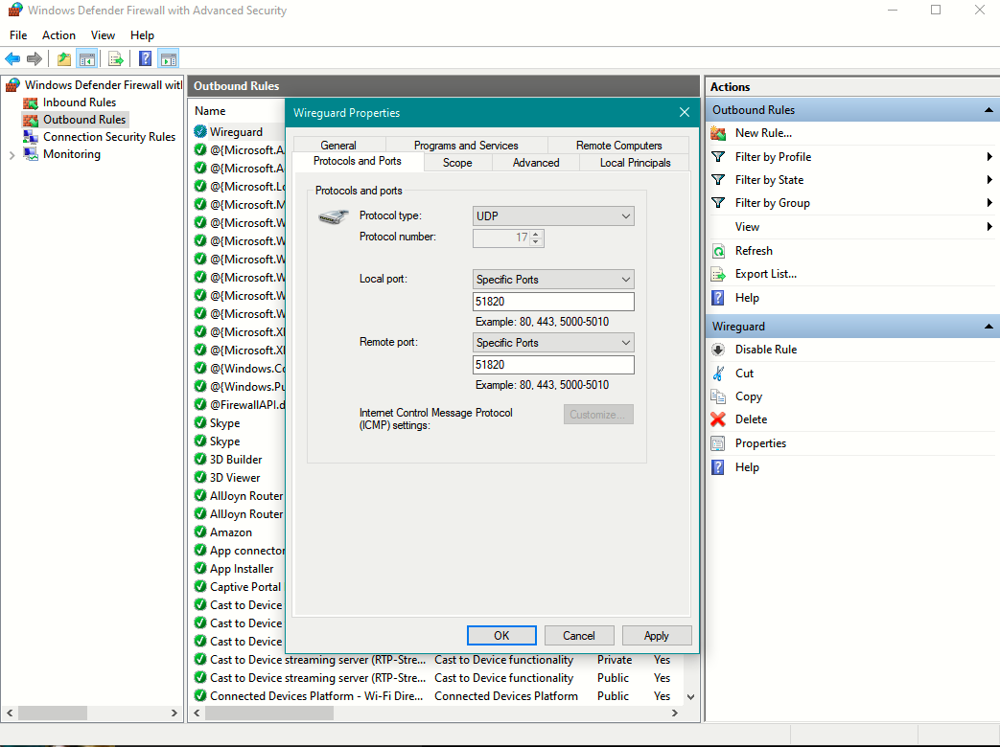
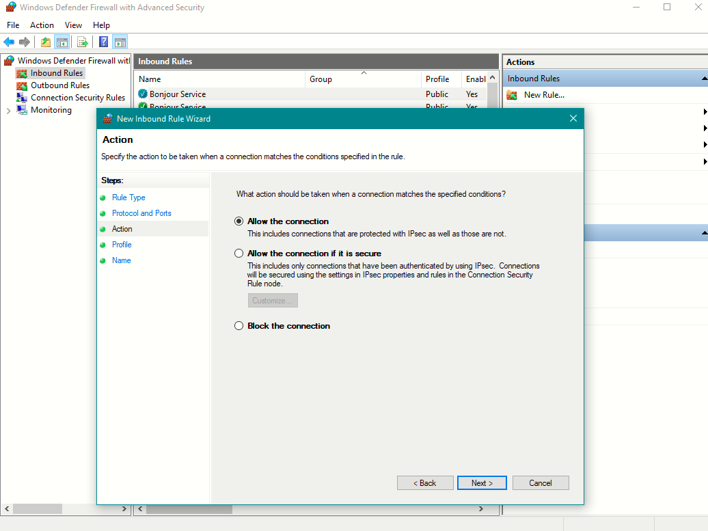
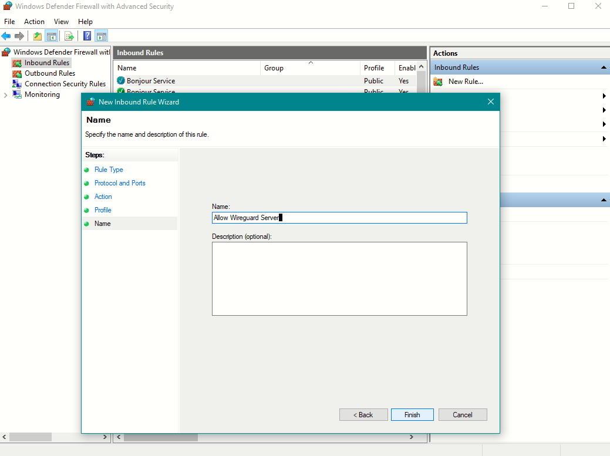
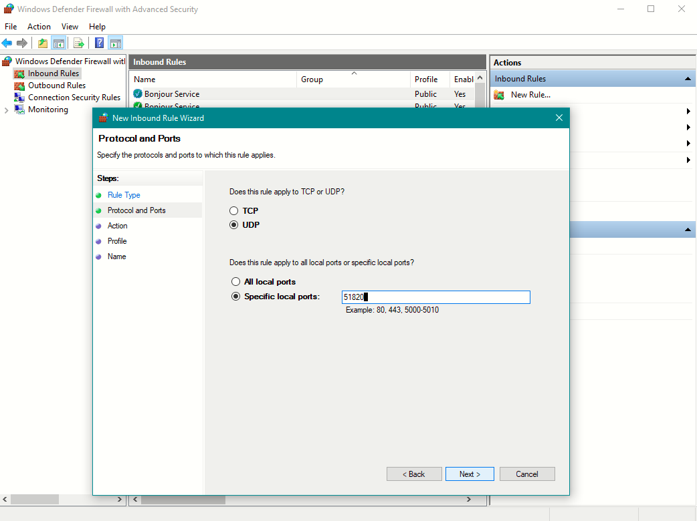
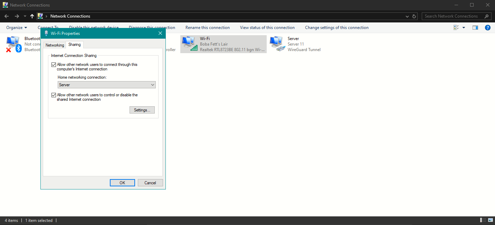
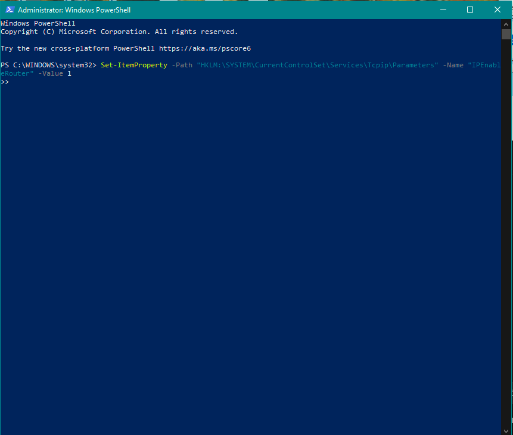
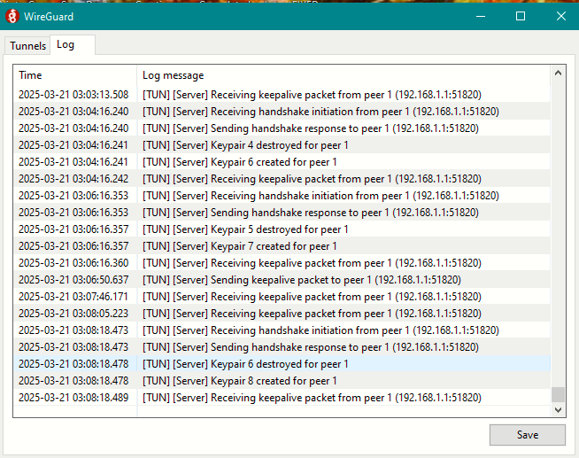
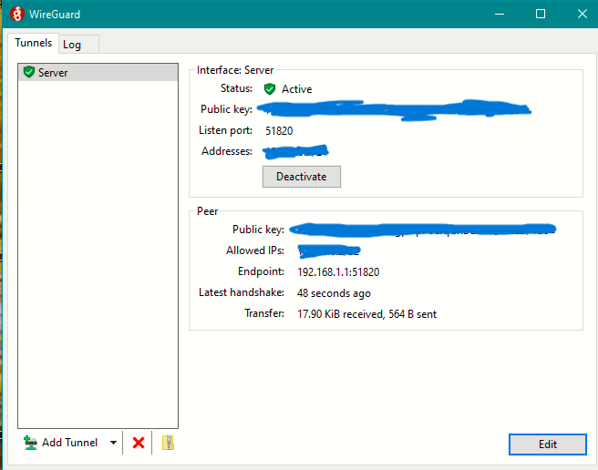
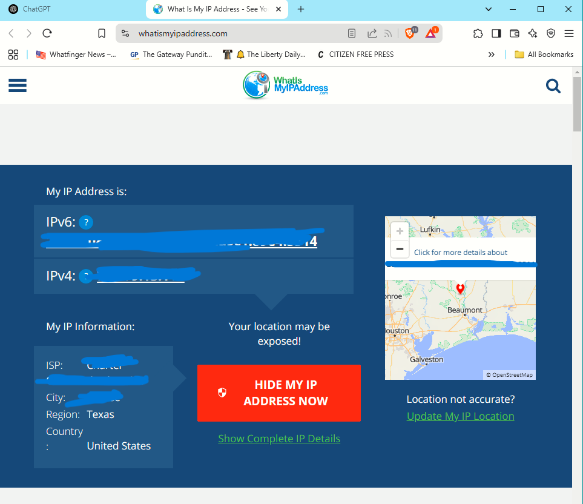
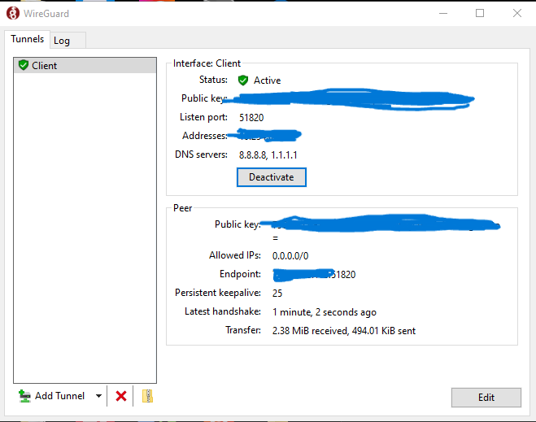

# Setting Up a WireGuard VPN Server on a Windows 10 HP Slimline 260-a020 Desktop and Routing All Client Traffic Through It

## Introduction
This guide walks through setting up a WireGuard VPN server on an old Windows 10 desktop (HP Slimline 260-a020), allowing a client (such as an Acer laptop, also running Windows 10) to connect and route all internet traffic through the tunnel. Unlike many guides that use Linux, this guide focuses on Windows, which presents unique challenges due to its more complex networking environment and firewall restrictions. This makes the setup process more difficult but also more rewarding, as it demonstrates how to overcome Windows-specific issues.

## What Makes This Guide Unique?
- **Windows 10-Based Server and Client**: Most VPN guides use Linux. This guide tackles the unique difficulties of using Windows, such as firewall conflicts and routing issues.
- **Troubleshooting Windows-Specific Problems**: Windows is notorious for network inconsistencies, especially when dealing with VPNs, firewall settings, and port forwarding. This guide includes workarounds and fixes.
- **Repurposing Old Hardware**: Many VPN guides assume you have a dedicated Linux server. Here, we demonstrate how to turn an old HP Slimline 260-a020 desktop into a functional VPN server using Windows 10.

---

## Equipment
### Hardware
- **Server**: HP Slimline 260-a020 Desktop running Windows 10
- **Client**: Acer laptop running Windows 10
- **Router**: To configure port forwarding for external access

### Software
- **WireGuard for Windows**: VPN software for both server and client
- **Windows Firewall Rules**: To allow VPN traffic

---

## Setup Guide

### 1. Install WireGuard
#### On the Server (HP Slimline 260-a020 Desktop):
- Download and install WireGuard for Windows from the official website.

#### On the Client (Acer Laptop running Windows 10):
- Download and install WireGuard for Windows from the same source.

### 2. Generate Keys
#### On the Server:
- Open WireGuard on Windows and click **Generate Keypair** to create a public and private key for the server.

#### On the Client:
- Open WireGuard on the Acer laptop and click **Generate Keypair** to create the client’s public and private key.

### 3. Configure the WireGuard Server (HP Slimline 260-a020 Desktop)
- Open WireGuard and click **Add Tunnel → Create from Scratch**.
- Add the following configuration:

```ini
[Interface]
PrivateKey = YOUR_SERVER_PRIVATE_KEY
Address = 10.0.0.1/24
ListenPort = 51820

[Peer]
PublicKey = YOUR_CLIENT_PUBLIC_KEY
AllowedIPs = 10.0.0.2/32
```
- Click **Save** and then **Activate** the tunnel.

### 4. Configure the WireGuard Client (Acer Laptop running Windows 10)

- Open WireGuard on the client (Acer laptop) and create a new configuration.
- Use the following setting in the configuration file for the client:

```ini
[Interface]
PrivateKey = YOUR_CLIENT_PRIVATE_KEY
Address = 10.0.0.2/24
DNS = 1.1.1.1

[Peer]
PublicKey = YOUR_SERVER_PUBLIC_KEY
Endpoint = YOUR_SERVER_PUBLIC_IP:51820
AllowedIPs = 0.0.0.0/0
PersistentKeepalive = 25

```
- Click **Save** and then **Activate** the tunnel.

## 5. Configure Windows Firewall and Port Forwarding

Here are the screenshots for configuring the server firewall rules:

- Outbound firewall rule: 
- Allowing connection through the firewall: 
- Inbound rule for the server: 
- Incoming firewall rule setup: 

## 6. Enable Internet Connection Sharing (ICS) on the Server

To allow the server to share its internet connection with clients, follow the ICS setup. Here's a screenshot of the ICS sharing setup:

- ICS configuration: 

## 7. Configure IP Routing

Ensure IP routing is enabled on the server to forward traffic correctly:

- Enabling IP routing: 

## 8. Testing the Handshake and Transfer

After configuring everything, ensure the server is receiving the handshake and transferring traffic to the client:

- Handshake process: 
- WireGuard transfers traffic: 

## 9. Verify Public IP on Client

Verify that the client’s traffic is being routed through the VPN and check the public IP:

- Public IP check: 

## 10: Confirm Handshake on Client  

After verifying the public IP, check that the **WireGuard handshake is successfully established on the client**.  

- Client handshake verification: 


## ✅ Final Confirmation: Successful Traffic Forwarding  

Although I accidentally cropped out a screenshot, there was a **WireGuard adapter being shared through my Wi-Fi adapter**, confirming successful internet traffic forwarding through the VPN tunnel.  

- **Where to check:**  
  - Look at the **network status** in the Windows taskbar (bottom-right).  
  - It should show:  
    - **WireGuard Server - Internet access** ✅  
    - **Wi-Fi - Internet access** ✅  

This confirms that the **client's internet traffic is successfully being routed through the WireGuard VPN server tunnel.** 🎉  


---

## Troubleshooting Windows-Specific Issues

### 1. Windows Firewall Conflicts
- Ensure WireGuard is allowed in both **inbound** and **outbound** rules.

### 2. Network Adapter Issues
- Windows may fail to recognize the WireGuard adapter, requiring a manual restart of the service.

### 3. Port Forwarding Not Working
- Some Windows networking settings interfere with proper forwarding—disabling certain security policies may help.

### 4. DNS Issues
- Windows 10 sometimes struggles with DNS resolution over VPN tunnels. Manually setting a reliable DNS in the client config (e.g., **1.1.1.1** or **8.8.8.8**) can help.

### 5. ICS Not Sharing Correctly
- If internet sharing doesn’t work:
  - Try **disabling and re-enabling** ICS.
  - Select a different network interface in the settings.

---

## Future Improvements
- Add **Pi-hole** for ad-blocking.
- Use a **dedicated firewall device**.
- Automate **firewall rule setup** with PowerShell.

---

## Disclaimer
Ensure you comply with all **network and ISP policies** when setting up a VPN.
